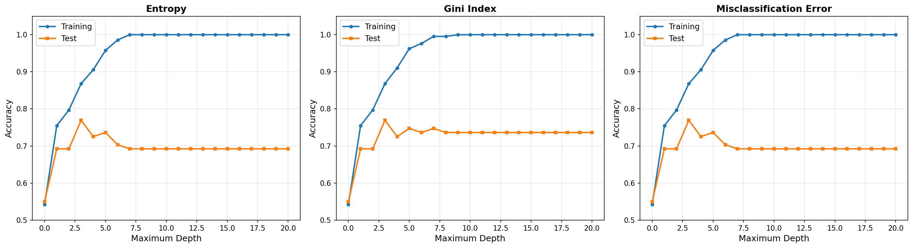

# Logistic Regression, SVM, and Decision Trees

A comprehensive analysis and comparison of classification algorithms: Logistic Regression, Support Vector Machines (hard and soft-margin), and Decision Trees (with ensemble methods).

## Overview

This repository contains modular, production-quality implementations for comparing classical machine learning algorithms on multiple datasets. Each experiment is carefully designed to explore theoretical concepts and practical performance.

## Installation

```bash
# Clone the repository
git clone https://github.com/sabdulmajid/logistic-regression-SVM-benchmark.git
cd logistic-regression-SVM-benchmark

# Install dependencies
pip install -r requirements.txt
```

## Usage

Run each experiment independently:

```bash
# Dataset A: Logistic Regression vs SVM
python run_dataset_a.py

# Dataset B: Test set evaluation
python run_dataset_b.py

# Decision Trees: Depth analysis
python run_decision_trees.py

# Ensemble Methods: Bagging vs Random Forest
python run_ensemble.py
```

## Results

### Dataset A Analysis

**Goal:** Compare logistic regression, soft-margin SVM, and hard-margin SVM.

**Dataset:** 2000 samples, 50 features, perfectly balanced classes (1000 each)

**Results:**
| Method | Training Accuracy | Support Vectors | Coefficient Norm |
|--------|------------------|-----------------|------------------|
| Logistic Regression | 100.00% | N/A (uses all) | 30.00 |
| Soft-margin SVM (C=1.0) | 100.00% | 2 (0.10%) | 1.00 |
| Hard-margin SVM (C=∞) | 100.00% | 2 (0.10%) | 1.00 |

**Key Findings:**
- **Dataset A is perfectly linearly separable** - all methods succeed
- Only 2 support vectors needed (0.10% of data)
- All 2000 points lie exactly on the margin boundaries
- SVM achieves perfect separation with minimal coefficient norm

**SVM Margin Analysis:**
- All points satisfy `y_i(w·x_i) = 1` (on margin)
- Weight vector: `w = Σ αᵢyᵢxᵢ` with only 2 support vectors
- Reconstruction error: ~0 (perfect representation)

**Comparison:**
| Method | Loss Function | Output | Solution Sparsity |
|--------|--------------|---------|-------------------|
| Logistic Regression | Log-loss | Probabilities | Dense (all 2000 points) |
| SVM | Hinge loss | Binary labels | Sparse (2 support vectors) |

### Dataset B Analysis

**Goal:** Evaluate methods on non-separable data with held-out test set.

**Dataset:** 2000 training samples, 2000 test samples, 50 features

**Results:**
| Method | Train Accuracy | Test Accuracy | Support Vectors |
|--------|---------------|---------------|-----------------|
| Logistic Regression | 98.85% | **96.95%** | N/A |
| Soft-margin SVM (C=1.0) | 98.65% | **97.35%** | 198 (9.90%) |
| Hard-margin SVM (C=∞) | 96.50% | 95.25% | 357 (17.85%) |

**Key Findings:**
- **All three methods succeed** - Dataset B is still linearly separable
- Soft-margin SVM achieves best test accuracy (97.35%)
- Hard-margin uses more support vectors (357 vs 198), slightly lower performance
- SVM parameter vector uses only 198 points (9.90% of training data)
- Excellent generalization across all methods

### Decision Tree Analysis

**Goal:** Compare splitting criteria (entropy, Gini, misclassification error) across tree depths.

**Dataset:** 212 training samples, 91 test samples, 13 features (heart disease data)

**Best Performance:**
| Criterion | Optimal Depth | Test Accuracy |
|-----------|--------------|---------------|
| Entropy | 3 | **76.92%** |
| Gini Index | 3 | **76.92%** |
| Misclassification | 3 | **76.92%** |

**Observations:**
- **All criteria perform identically** - optimal depth is 3
- **Shallow trees (0-3):** Underfitting, both accuracies low
- **Optimal depth (3-5):** Test accuracy peaks at ~77%
- **Deep trees (6-20):** Training → 100%, test plateaus (classic overfitting)

**Key Insight:** Widening train/test accuracy gap with depth is the signature of overfitting.



### Ensemble Methods

**Goal:** Compare Bagging and Random Forest (101 trees, max depth 3, 11 runs).

**Configuration:**
- **Bagging:** All 13 features considered at each split
- **Random Forest:** √13 ≈ 3 features randomly selected per split
- **Setup:** 101 trees, max depth 3, 11 independent runs

**Results:**
| Method | Median | Min | Max | Mean | Std Dev |
|--------|--------|-----|-----|------|---------|
| Bagging | 81.32% | 80.22% | 83.52% | 81.82% | 1.18% |
| **Random Forest** | **83.52%** | 82.42% | **85.71%** | 83.92% | 1.08% |

**Key Findings:**
- **Random Forest outperforms Bagging** by 2.2 percentage points
- Random Forest more consistent (lower std dev: 1.08% vs 1.18%)
- Feature randomization successfully decorrelates trees
- Both methods outperform single tree optimal accuracy (76.92%)
- Ensemble improvement: **+6% to +9%** over single trees

**Why Random Forest Wins:**
- Feature subsampling creates more diverse trees
- Reduces correlation between ensemble members
- Better generalization through increased randomness
- Particularly effective on this dataset with 13 features

## Theoretical Insights

### Linear Separability and SVM

The hard-margin SVM optimization:
```
minimize   (1/2)||w||²
subject to y_i(w·x_i) ≥ 1  for all i
```

When data is **not linearly separable**, no hyperplane satisfies all constraints. The feasible set is empty.

**Remedies:**
1. **Soft-margin SVM (C < ∞):** Introduce slack variables
2. **Kernel methods:** Map to higher-dimensional space
3. **Alternative classifiers:** Logistic regression, neural networks

**Note:** Both Dataset A and B are linearly separable, so hard-margin SVM succeeds.

### Overfitting in Decision Trees

Deep trees memorize training data:
- Training accuracy → 100%
- Test accuracy plateaus or decreases
- High variance, low generalization

**Solution:** Ensemble methods average multiple trees, reducing variance while maintaining low bias.
